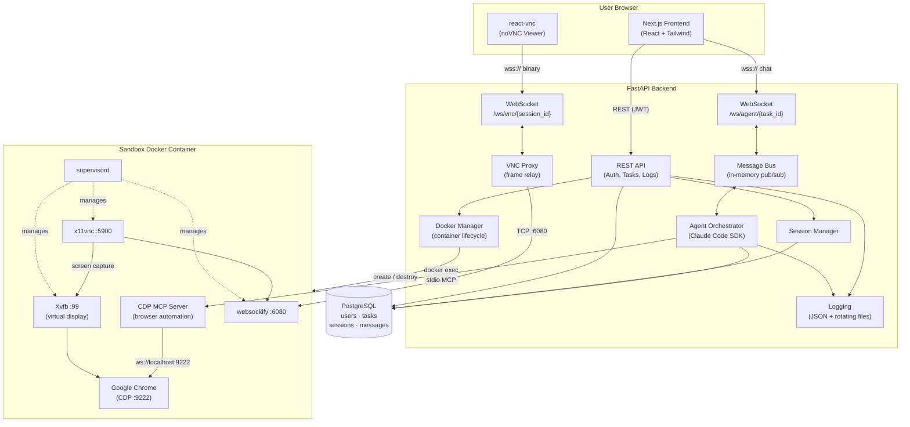
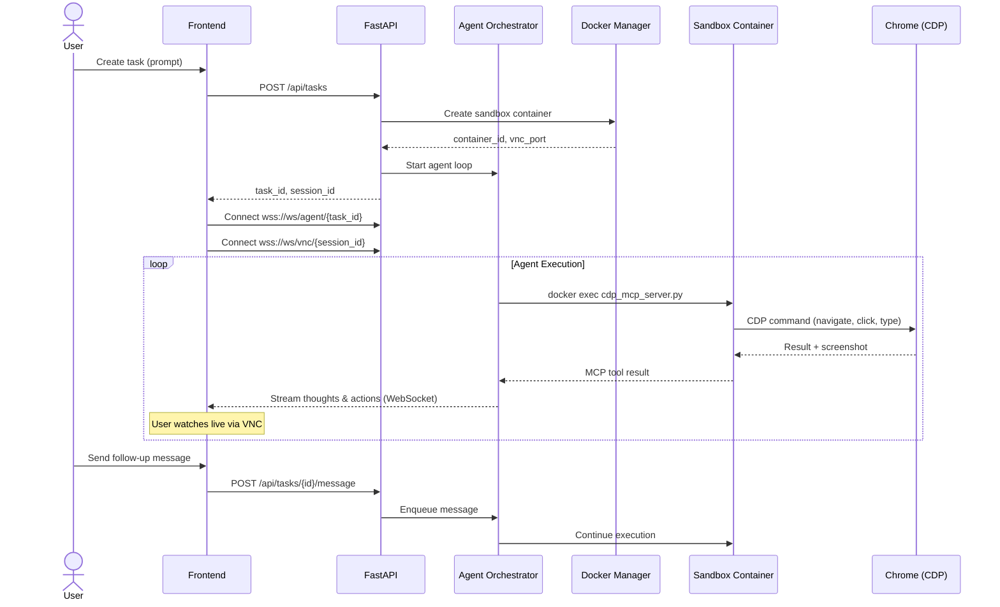

# CompSphere

AI agent platform that executes tasks in sandboxed Docker containers with a real browser. Users watch the agent navigate websites in real time through a live VNC stream, take control of the browser, and chat with the agent from a split-panel interface.

## Tech Stack

| Layer | Technology |
|-------|-----------|
| **Frontend** | Next.js 14, React 18, TypeScript, Tailwind CSS |
| **VNC Client** | react-vnc (noVNC) for live browser streaming |
| **Layout** | react-resizable-panels for split-panel interface |
| **Backend** | FastAPI, Uvicorn (Python) |
| **ORM** | SQLAlchemy 2.0 (async) with asyncpg |
| **Database** | PostgreSQL 16 |
| **Migrations** | Alembic |
| **Auth** | JWT (python-jose) with bcrypt password hashing |
| **AI Agent** | Claude Code SDK with custom MCP server |
| **Browser Automation** | CDP MCP Server (Chrome DevTools Protocol via WebSocket) |
| **Sandboxing** | Docker SDK for Python (container lifecycle management) |
| **VNC Pipeline** | Xvfb, Fluxbox, x11vnc, websockify |
| **Browser** | Google Chrome (in sandbox container) |
| **Process Management** | supervisord (sandbox services) |
| **Orchestration** | Kubernetes (k3s) with Traefik ingress |

## Features

- **AI Agent with Browser Control** -- Claude Code SDK agent navigates real websites using accessibility trees and screenshots (CDP-based MCP server), fills forms, extracts data, and runs terminal commands inside isolated containers
- **Live Browser View** -- Real-time VNC stream of the agent's browser via react-vnc; watch every action as it happens
- **Take Control Anytime** -- Toggle between view-only and interactive mode to click, type, and scroll in the live browser while the agent is idle
- **Persistent Browser Sessions** -- Chrome runs detached from the agent process and stays alive after task completion; cookies, logins, and open tabs persist across agent invocations via per-user browser profiles; containers are only destroyed when the task is deleted
- **Split-Panel Interface** -- Resizable chat + browser panels with fullscreen mode and browser visibility toggle
- **Real-Time Chat** -- WebSocket-based message streaming showing agent thoughts, tool calls, tool results, and errors
- **Task Management** -- Create, list, view, and delete tasks; tasks grouped by date (Today, Yesterday, Last 7 Days, Older)
- **JWT Authentication** -- Email/password registration and login with 24-hour token expiry
- **Message Deduplication** -- Content-based dedup with 2-second window prevents duplicates from React StrictMode

## Architecture



### Request Lifecycle



## Project Structure

```
compsphere/
├── backend/
│   ├── main.py                    # FastAPI app entry point
│   ├── config.py                  # Settings (pydantic-settings, env-based)
│   ├── core/
│   │   └── logging_config.py      # Structured JSON logging
│   ├── middleware/
│   │   └── request_logging.py     # Request/response logging
│   ├── models/
│   │   ├── database.py            # SQLAlchemy async engine and session
│   │   ├── user.py                # User model (email, password_hash)
│   │   ├── task.py                # Task model (prompt, status, result)
│   │   └── session.py             # AgentSession and AgentMessage models
│   ├── routers/
│   │   ├── auth.py                # Register, login, current user
│   │   ├── tasks.py               # Task CRUD + agent lifecycle
│   │   ├── ws.py                  # WebSocket: agent chat + VNC proxy
│   │   └── client_logs.py         # Frontend error log receiver
│   ├── services/
│   │   ├── agent_orchestrator.py  # Claude Code SDK agent loop with MCP
│   │   ├── docker_manager.py      # Container create/destroy/exec
│   │   ├── session_manager.py     # Session lifecycle management
│   │   ├── vnc_proxy.py           # WebSocket VNC frame relay
│   │   ├── message_bus.py         # In-memory pub/sub for agent messages
│   │   └── agent_message_queue.py # Per-task follow-up message queues
│   ├── alembic/                   # Database migrations
│   └── requirements.txt
├── frontend/
│   ├── src/
│   │   ├── app/
│   │   │   ├── page.tsx           # Landing page
│   │   │   ├── layout.tsx         # Root layout (dark mode, navbar)
│   │   │   ├── auth/              # Login and register pages
│   │   │   ├── agent/             # Agent task page
│   │   │   ├── chat/              # Chat interface with browser view
│   │   │   └── dashboard/         # Dashboard redirect
│   │   ├── components/
│   │   │   ├── ChatPanel.tsx      # Message list + input
│   │   │   ├── BrowserView.tsx    # VNC viewer + controls
│   │   │   ├── AgentMessage.tsx   # Message bubble renderer (by type)
│   │   │   ├── ChatTopBar.tsx     # Status bar + toggle controls
│   │   │   ├── Sidebar.tsx        # Task list sidebar
│   │   │   └── WelcomePrompt.tsx  # New task prompt + templates
│   │   └── lib/
│   │       ├── api.ts             # REST client (fetch + JWT)
│   │       ├── ws.ts              # WebSocket hook with dedup
│   │       └── logger.ts          # Client-side error logger
│   └── package.json
├── sandbox/
│   ├── Dockerfile.sandbox         # Ubuntu 22.04 + Xvfb + VNC + Chrome + Node.js
│   ├── cdp_mcp_server.py          # CDP browser automation MCP server (~800 lines)
│   ├── supervisord.conf           # Process manager config
│   └── entrypoint.sh              # Container entrypoint
├── docker-compose.yml             # Local development (PostgreSQL, backend, frontend, nginx)
├── k8s.yaml                       # Kubernetes manifests (deployments, services, ingress)
└── nginx.conf                     # Nginx reverse proxy config
```

## Setup

### Prerequisites

- Docker with Docker Compose
- Node.js 20+
- Python 3.12+
- PostgreSQL 16 (or use the Docker Compose service)
- Anthropic API key (for Claude Code SDK)

### Build the Sandbox Image

The sandbox image must be built before running the platform:

```bash
cd sandbox
docker build -t compshere-sandbox:latest -f Dockerfile.sandbox .
```

### Local Development (Docker Compose)

1. Create a `.env` file in the project root:

```
ANTHROPIC_API_KEY=sk-ant-...
SECRET_KEY=your-random-secret-key
```

2. Start all services:

```bash
docker compose up -d
```

3. Access the app:
   - Frontend: http://localhost (via nginx) or http://localhost:3000 (direct)
   - Backend API: http://localhost:8000
   - Health check: http://localhost:8000/api/health

### Local Development (Without Docker)

```bash
# Backend
cd backend
pip install -r requirements.txt
uvicorn main:app --host 0.0.0.0 --port 8000 --reload

# Frontend (separate terminal)
cd frontend
npm install
npm run dev
```

### Kubernetes (Production)

```bash
# Create namespace and secrets
kubectl create namespace compsphere
kubectl create secret generic compsphere-secrets \
  -n compsphere \
  --from-literal=ANTHROPIC_API_KEY=sk-ant-... \
  --from-literal=SECRET_KEY=your-random-secret-key

# Apply manifests
kubectl apply -f k8s.yaml

# Verify
kubectl get pods -n compsphere
```

## Environment Variables

### Backend

| Variable | Default | Description |
|----------|---------|-------------|
| `DATABASE_URL` | `postgresql+asyncpg://...` | PostgreSQL connection string |
| `SECRET_KEY` | `change-me-in-production` | JWT signing key |
| `ALGORITHM` | `HS256` | JWT algorithm |
| `ACCESS_TOKEN_EXPIRE_MINUTES` | `1440` | JWT token lifetime (24h) |
| `ANTHROPIC_API_KEY` | *(required)* | Anthropic API key for Claude Code SDK |
| `MAX_CONCURRENT_SESSIONS` | `2` | Max simultaneous sandbox containers |
| `CONTAINER_TTL_MINUTES` | `30` | Container idle timeout |
| `SANDBOX_IMAGE` | `compshere-sandbox:latest` | Docker image for sandbox containers |
| `BROWSER_PROFILES_PATH` | `/data/browser-profiles` | Persistent browser profile storage path |
| `DOCKER_HOST_IP` | `localhost` | Host IP for VNC connections |

### Frontend

| Variable | Default | Description |
|----------|---------|-------------|
| `NEXT_PUBLIC_API_URL` | *(empty, same origin)* | Backend API base URL |
| `NEXT_PUBLIC_WS_URL` | *(empty, same origin)* | WebSocket base URL |

## API Endpoints

### REST

| Method | Path | Description | Auth |
|--------|------|-------------|------|
| `POST` | `/api/auth/register` | Create account | No |
| `POST` | `/api/auth/login` | Login (returns JWT) | No |
| `GET` | `/api/auth/me` | Current user profile | Yes |
| `POST` | `/api/tasks` | Create task and start agent | Yes |
| `GET` | `/api/tasks` | List user's tasks | Yes |
| `GET` | `/api/tasks/{id}` | Task detail with sessions and VNC URL | Yes |
| `DELETE` | `/api/tasks/{id}` | Delete task and destroy container | Yes |
| `POST` | `/api/tasks/{id}/message` | Send follow-up message to agent | Yes |
| `GET` | `/api/health` | Health check with active session count | No |
| `POST` | `/api/client-logs` | Receive frontend error logs | No |

### WebSocket

| Path | Description |
|------|-------------|
| `wss://.../ws/agent/{task_id}` | Bidirectional agent chat (JSON messages) |
| `wss://.../ws/vnc/{session_id}` | Binary VNC frame proxy for live browser view |

## Database Schema

Four tables with UUID primary keys and cascade deletes:

- **users** -- email, password_hash, created_at
- **tasks** -- user_id (FK), name, prompt, status, result_summary
- **agent_sessions** -- task_id (FK), container_id, vnc_port, status (creating/running/idle/completed)
- **agent_messages** -- session_id (FK), role, content, tool_name, tool_input, tool_result, sequence_num

## License

Proprietary. All rights reserved.
